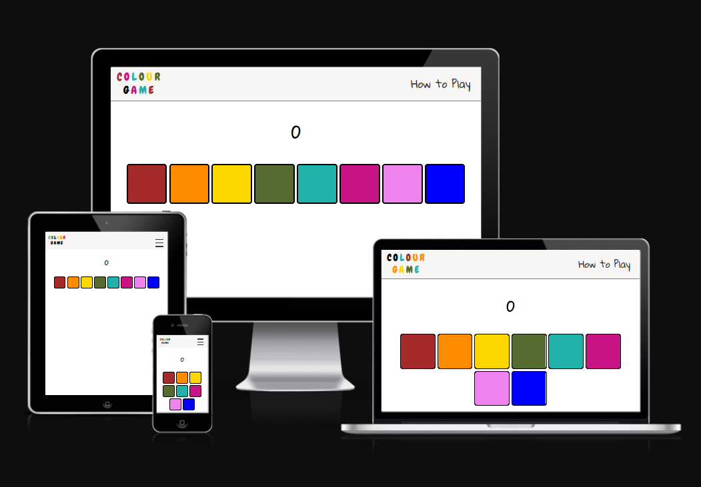
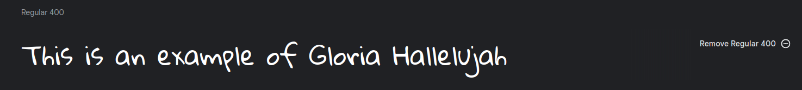
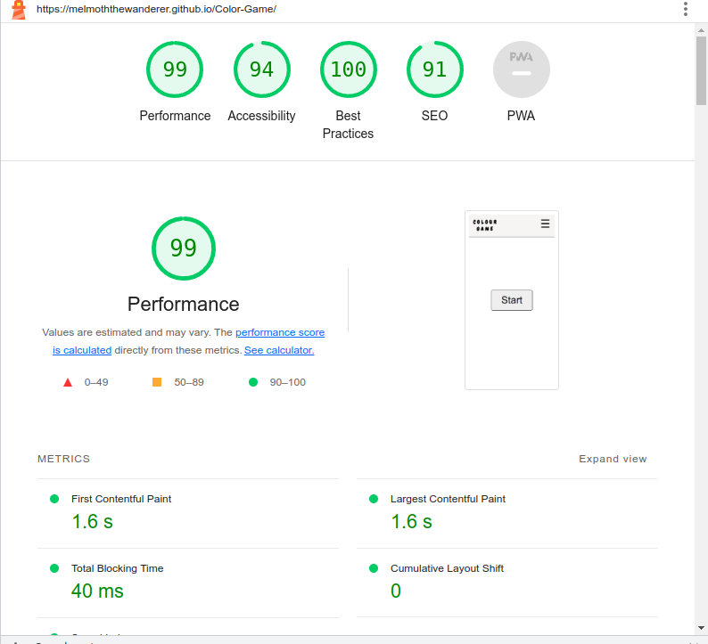
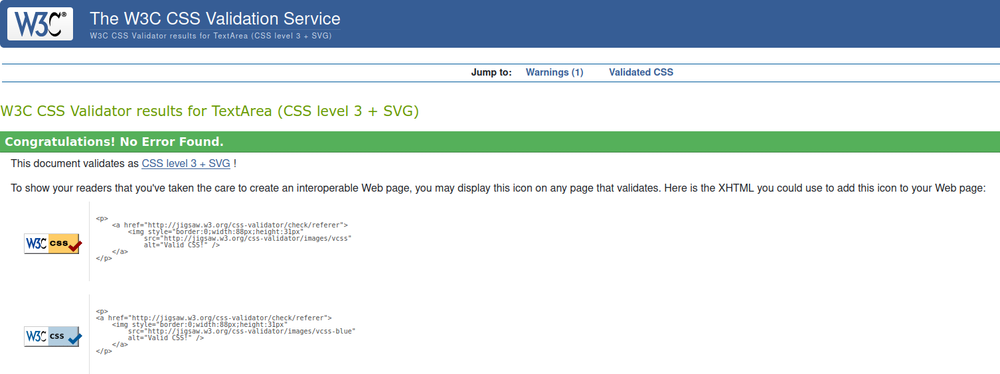

# Color Game
## An interactive musical memory game.

## Basic Concept

The idea behind "Color-Game" is to provide an interactive exercise that will test the users memory.  
The game has both a visual component and an auditory component.
Eight colorful buttons are presented to the user after they begin the game. Each of these buttons corresponds to a note on the major scale.  
These buttons will display a pattern to the user that they must then reproduce by clicking the buttons in the right order.
The buttons themselves are musical, and play the notes as the user presses them.   
The pattern is not differnent each time , it builds upon the previous pattern with each "round" of the game. I decided that this was the most satisfying way  to present the patterns to the user , as it is easy to remember patterns that are reoccuring.  
If the user reproduces the pattern that was presented , then they are awarded a point , and the game progesses to the next round. 
When the user inevitably makes a mistake (unless of course you are rain man), the game will display a score at the end.  

This game is intended for anyone looking for a light memory exercise to improve their memory and pattern recognition skills. The idea is that the user will challenge themselves to beat the previous score that they have gotten.

## Design

### Choice of colours

The buttons of the game needed to stand out above all, and so I opted to keep the color scheme quite simple. The navigation bar is a subtle off-white color, to differntiate it from the body of the page, which is quite simply white.

The colours come from the game buttons, which are a variation of the colors of the rainbow. These stand out nicely against the white background, especially with the little bit of a black border.  

The only other use of colour is in the "Color Game" logo. As the user hovers their mouse of the letters they change from black to a random color that is within the palette of the game, a variation on the colors of the rainbow.

### Choice of font

I wanted to choose a font that was bubbly and almost childish , because the bright colors of the game remind me of crayons and childrens drawings.  
The font that I have chosen for the logo is called "Chewy" and I found it on Google fonts and imported it into the css of my project.

The only other font I have used is for the link to the about page and the score. Again , I wanted to keep with the light bubbly childish theme, but wanted a different font to diffrenciate from the logo  
I opted for a font called "Gloria Hallelujah" , also found on Google Fonts.

## Features Left to Implement

In the future, I would like to:

- add listeners for keystrokes so that the game can be more easily played by those with impaired vision.

- Allow users to list their score on a scoreboard along with their name. 

- Perhaps change the background as you get to higher levels, and allow encouraging messages to appear on screen, to cheer the player on.

- Allow for a head to head mode, where on the pattern isn't computer generated , but chosen by an opposing player. By guessing the correct pattern , the player gets to choose the next pattern, which their opponent will have to reproduce.

## Accessibility

I have done the following to maintain accessibility.

-Using aria labels.  
-Making sure that the background and the foreground don't contrast.  
-Make sure that text is legible.  
-Used Lighthouse to ensure a decent level of accessibility  
  

## Technologies used

### Languages used

The languages used in this project were HTML , CSS , and Javascript

### Programs and resources used

- [Virtual Studio](https://code.visualstudio.com/download) was used as my IDE.
- [Github](https://github.com/) was used for version control. 
- [Google Fonts](https://fonts.google.com/) was used for all the fonts.
- [Freesound](https://www.freesound.org) was used for all of the sounds throughout the game. 
- [Color Hunt](https://www.colorhunt.co) was used to get ideas for colors.
- [GIMP](https://www.gimp.org/) image editor was used to make images for this readme file and for the favicon.
- [W3C](https://www.w3.org/) was used to validate and lint the HTML and CSS.
- [JSHint](https://jshint.com) was used to validate and lint the javascript.
- [Beautifier](https://beautifier.io/) was used to automatically make indentation cosistent.
- [Lighthouse](https://developer.chrome.com/docs/lighthouse/) was used to audit the site for accessibility.

## Testing

I tested the HTML and CSS using the [W3C](https://validator.w3.org/) validators: 

I used the same website to validate my CSS code: 

For my Javascript validation I used [JSHint](https://jshint.com/)

For accesability testing I used Lighthouse : 

  

For testing resposiveness I used the live server extenstion in VSCode, but also Chrome dev tools . 

## Deployment 

I used Github pages for the deployment of this project. Github makes this a really easy process: 

- Log into Github
- Navigate to the repository that you wish to deploy.  
- Go to the settings page for that repository.   
- Scroll down to a tab called "Pages".  
- You should see a "sources" drop down menu where you can select the branch. In my experience this is usually "master".  
- Click save and wait a little moment before refreshing. There ought to be a link to your live page if all went well.

## Other resources used

[W3S](https://www.w3schools.com/) was an invaluable resource for a quick recap on something that I've forgotten.

## Acknowledgments

   - Derek MCAuley, massive help and motivation. 

