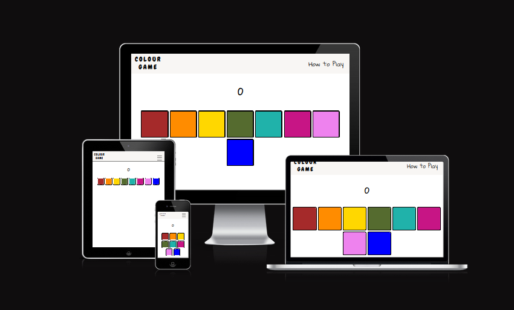
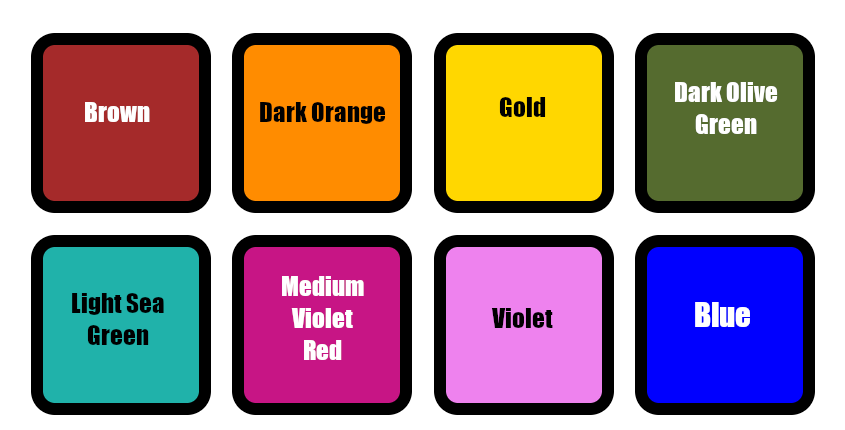
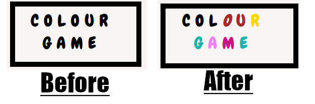
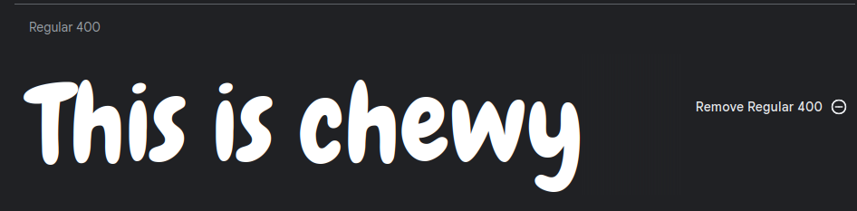

# Color Game
## An interactive musical memory game.

The idea behind "Color-Game" is to provide an interactive exercise that will test the users memory.  
The game has both a visual component and an auditory component.
Eight colorful buttons are presented to the user after they begin the game. Each of these buttons corresponds to a note on the major scale.  
These buttons will display a pattern to the user that they must then reproduce by clicking the buttons in the right order.
The buttons themselves are musical, and play the notes as the user presses them.   
The pattern is not differnent each time , it builds upon the previous pattern with each "round" of the game. I decided that this was the most satisfying way  to present the patterns to the user , as it is easy to remember patterns that are reoccuring.  
If the user reproduces the pattern that was presented , then they are awarded a point , and the game progesses to the next round. 
When the user inevitably makes a mistake (unless of course you are rain man), the game will display a score at the end.  

This game is intended for anyone looking for a light memory exercise to improve their memory and pattern recognition skills. The idea is that the user will challenge themselves to beat the previous score that they have gotten.

## Design

### Choice of colours

The buttons of the game needed to stand out above all, and so I opted to keep the color scheme quite simple. The navigation bar is a subtle off-white color, to differntiate it from the body of the page, which is quite simply white.

Where the only colors come from the game buttons, which are a variation of the colors of the rainbow. These stand out nicely against the white background, especially with the little bit of a black border.  

The only other use of colour is in the "Color Game" logo. As the user hovers their mouse of the letters they change from black to a random color that is within the palette of the game, a variation on the colors of the rainbow.

### Choice of font

I wanted to choose a font that was bubbly and almost childish , because the bright colors of the game remind me of crayons and childrens drawings.  
The font that I have chosen for the logo is called "Chewy" and I found it on Google fonts and imported it into the css of my project.

